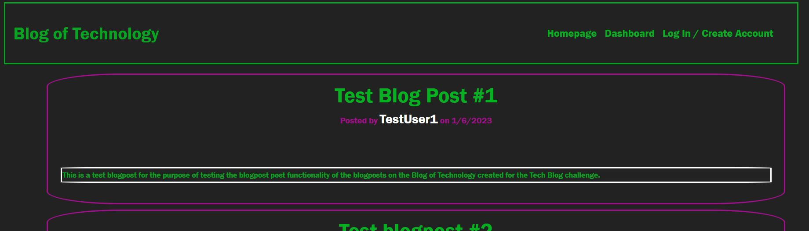

# tech-blog
## Week 14 Challenge: Model-View-Controller

<!--  -->

## Live Link
https://bburns-tech-blog.herokuapp.com/

## Repository Link
https://github.com/blakerichardburns/tech-blog

## Description
Blog where users can post about all things Tech, and comment on each other's posts.

  ## Table of Contents
  * [Installation Instructions](#installation-instructions)
  * [Questions](#questions)

  ## Installation Instructions
express-handlebars, MySQL2, Sequelize, Express, dotenv, bcrypt, express-session, connect-session-sequelize

  ## Questions
  For any inquiries, spam by inbox here: blakerichardburns@gmail.com
  To peruse more of my portfolio, check this out: [blakerichardburns](https://github.com/blakerichardburns)